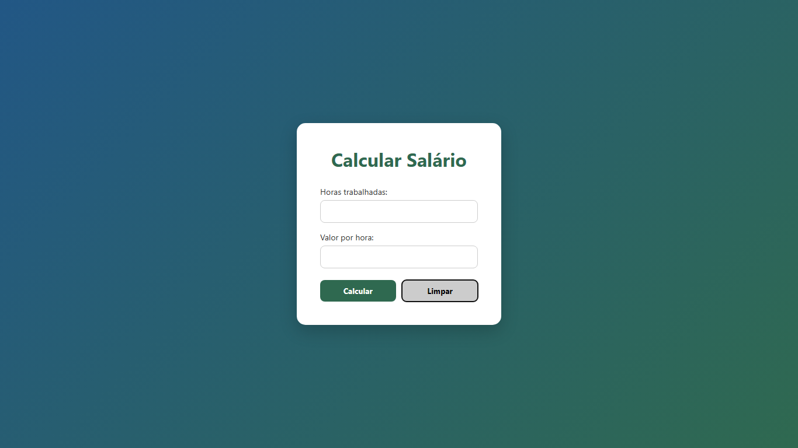

# 💰 Cálculo de Salário

Projeto simples para calcular o salário com base nas horas trabalhadas e no valor por hora.

---

## 🖥️ Tela Inicial

---

## 📊 Resultado

---

## ⚙️ Tecnologias

- HTML
- CSS
- PHP

---

## 📁 Estrutura

index.html  
style.css  
calcularSalario.php  

---

## 👩‍💻 Autora

Mariana Pereira de Queiroz
